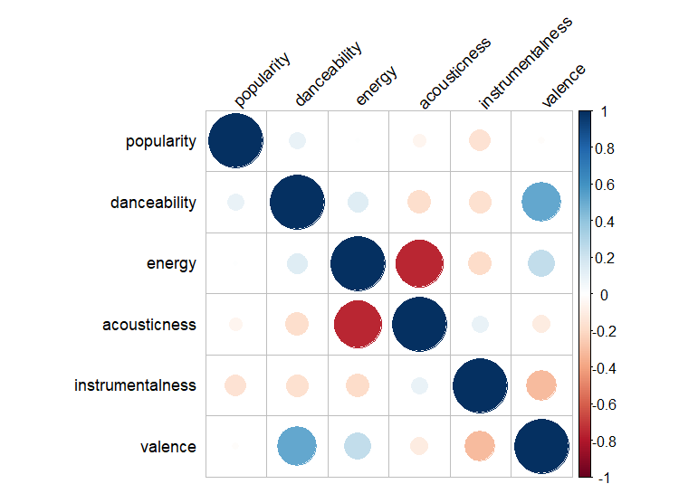

# Spotify Top Songs Analysis & Predictive Modelling

## Project Overview:

This analysis explores what internal attributes (outside of a typical genre) contribute to a song's popularity on Spotify, focusing on characteristics like 'danceability', 'energy', and more. I wanted to exclude genre from the predictive models as I believe the outcomes for most popular genres could much more easily be anticipated.

## Broad Insights:
Though this won’t be a part of my models, I did want to give a general overview on the impact of  genre and release date.
### Popularity by Genre:

Observation: Pop, hip-hop, dance, and indie-pop genres show varying levels of popularity, with pop leading (no big surprises here). However, it is interesting that there is variance among pop songs indicated by the smoothness of the slope.

## Year of Release Impact
A clear trend shows newer songs tend to be more popular. This makes sense as it correlates with Spotify's growing user base. 

## Regression Models and Predictions

### Multivariate Linear Regression
Starting out with a simple, multivariate linear regression model with handpicked predictors.

Results:

There is statistical significance for all the predictors but very low R squared value (4.7%). This means that while the predictors do have a statistical impact on popularity, their impact in a linear model is very low.

Impact of the predictors on popularity (plotting the co-efficents of the regression on a graph)

### Checks for Issues:
It’s also a good idea to check for the pitfalls of multi-collinearity and heteroscedasticity that can impact linear models and their overall performance.

Multi-collinearity, put simply, is a situation where the predictors in a model are so heavily co-related to each other that they impact the overall model’s accuracy.

I can test for this by using ‘variance inflation factors’ which are measures of which the variance of a coefficient is increased due to multicollinearity.

I can also see which predictors are related to each other with the following plot that measures co-relation:

Here, VIFs do not reach a high degree (around 5) so we can mostly ignore this as an issue.

Heteroscedasticity is a condition where the residuals/errors (basically the degree of ‘mistakes’ made by the model on data points, indicated by the distance of the actual point from the regression line) are not uniformly spread across.
This causes issues for linear models that assume the reverse – a uniform distribution.

I can test this out by looking at a graph or conducting a statistical test called a Breusch-Pagan test.
Here the Breusch-Pagan test indicates the presence of significant heteroscedasticity, and the graph re-affirms this. (The curve in the middle of the line also indicates there could be a non-linear relationship between the predictors and the dependent variable. I will address this, but after a few steps as detailed below).

There are several ways to address the related problems of low r-squared value and heteroscedasticity. I will tackle them here in order of simplicity from tweaks to the existing models to the use of different, non-linear models.

### Transformation of dependent variable:
First, I can transform the dependent variables using things like square roots and logarithms. I will try out a log transformation because its impact would be more notable:

The R squared value is even worse and heteroscedasticity remains. Other transformations probably wouldn’t help much if the log failed so badly (except those that are significantly more advanced). 

### Weighted Least Squares:
WLS can be a good method to tackle heteroscedasticity as each observation is weighted in the based on the inverse of the variance of residuals. 
Taking the inverse of squared residuals gives weights such that observations with larger residuals (thus, greater variance) have smaller weights.

There seems to be crazy amount of overfitting to get a r squared value of 1. This model cannot be a good indicator at all.

### Generalized Additive Models:

My attempts at linear models have failed so far, as suggested by the graph for heteroscedasticity that was mentioned earlier, and we can now address it. Perhaps the relationship between predictors and dependent variable is simply too non-linear for such models to capture.

To start with, we can go with GAMs. These are a kind of extension of linear regression models but with contingencies for dealing with non-linear relationships via what are called smooth functions. Thus, if the relationship between some predictors and the dependent variable is not linear, they can be accounted for by the use of such functions.

On a GAM I can apply a ‘smooth’ function to deal with predictors that have higher degrees of non-linear relationships. 

Most of the predictors actually do exhibit varying degrees of non-linearity. Examining these I will try it out on instrumentalness and energy.

Again, this doesn’t look like a great model. 

### Random Forest:
A random forest could prove to be a more robust model here as it does not assume any distributions in the data when modelling and simply take the averages of predictions of many decision trees. This makes it much more resilient to heteroscedasticity – and this would mostly not even be a big problem in the RF model

This looks to be our best result yet even though the predictive power of the model is still about only 10%.

Additionally, the OOB prediction error & RMSE (which should just be the square root which is approx. 15), when taken in the context of the 'range' of popularity (0-100) means that the model has an error of about '15' on a range of 0-100 which is definitely not great.
However, this can be explained by the fact that many, many more factors go into dictating the popularity of a song than just the variables in this dataset.

These include many external factors like trends, popularity of the artists, marketing of the song, virality, etc.

Thus, over our numerous analyses, we can conclude that while our chosen predictors are statically significant, many other, more important factors go into determining song popularity.

### Improved RF model:
However, the analysis is not fully over as I noticed something strange. When calculating RMSE separately from residuals and predictions made from the dataset, the value was 6.86 – much different from 15.
This probably means overfitting is present.

I can deal with this by adjusting some parameters. This includes reducing the depth of each decision tree which prevents too much ‘noise’ from being picked up, increasing the size of nodes, etc.

And indeed, when I compare this RMSE (taken as square root of OOB) to separate predictions, they both align at around 15.  True, the r square value decreased by about 2%, but this looks to be due to the previous model being overfit.

Thus, the RFs have provided the best results after taking measures to address overfitting.

## Conclusion:
I have tried out a wide variety of predictive models and attempted to make them as suitable as possible, looking out for factors that could influence their predictive strength and issues like overfitting.

I have found that though the internal song attributes chosen do have a statistical impact on a song's popularity, the amount of popularity that they can predict is not very high and about 8% in the best model.

Upon reflection, this is a logical outcome, given that, many more factors go into dictating the popularity of a song such as popularity of the artists, marketing of the song, virality, etc. This is corroborated by the many methods and models I used here.

## Dataset Attribution and Usage:

This project analyzes the "Spotify_1Million_Tracks" dataset to explore attributes contributing to song popularity on Spotify. The dataset is licensed under the Open Data Commons Open Database License (ODbL) v1.0.

Dataset Source: https://www.kaggle.com/datasets/amitanshjoshi/spotify-1million-tracks
License: Open Data Commons Open Database License (ODbL) v1.0. The original source of data is attributed in the link above.
